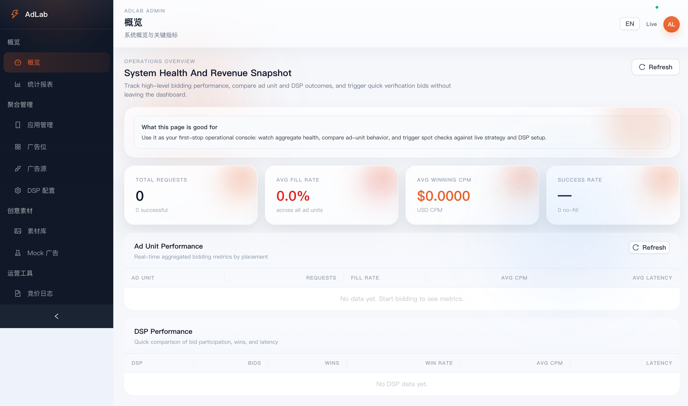

# AeroBid / AdLab

[中文说明](./README.zh-CN.md)


> A lightweight ad-tech lab for learning, testing, and prototyping mobile ad serving workflows.

## Preview



## Overview

AdLab is a lightweight full-stack ad-tech project for simulating and managing common monetization workflows, including:

- app / placement / source management
- placement-to-source binding with per-binding third-party ad unit IDs
- S2S / C2S / waterfall style bidding experiments
- mock ads and material management
- request logs, tracking events, and basic analytics
- a unified admin console for configuration and testing

This project is intended primarily for learning, internal experimentation, and prototype validation rather than operating as a production-grade ad exchange.

## Project Structure

The main working project is:

- [`adlab-server`](./adlab-server)

Inside it:

- Go backend API server
- React + Ant Design admin frontend
- Docker Compose deployment files
- SQLite / PostgreSQL database support

## Tech Stack

- Backend: Go, Gin, GORM
- Frontend: React, TypeScript, Vite, Ant Design
- Database: SQLite / PostgreSQL
- Deployment: Docker Compose, Nginx

## Features

- unified admin console
- source binding with binding-level third-party ad unit IDs
- mock bidding and DSP simulation support
- analytics, logs, and tracking views
- SQLite for local development
- PostgreSQL + Docker Compose deployment path

## Architecture

```text
Mobile SDK / Test Client
        |
        v
  Go Backend API
        |
        +-- Strategy / Bidding / Tracking
        +-- Admin APIs
        +-- Mock Ads / Materials
        |
        v
 SQLite (local) / PostgreSQL (deploy)
        |
        v
 React Admin Console
```

## Quick Start

### Local Development

Backend:

```bash
cd adlab-server
go run ./cmd/server/main.go
```

SDK API only:

```bash
cd adlab-server
go run ./cmd/sdkapi/main.go
```

Or with Make:

```bash
cd adlab-server
make run-sdkapi
```

Frontend:

```bash
cd adlab-server/admin-frontend
npm install
npm run dev
```

### Docker Deployment

See:

- [PostgreSQL + Docker Compose deployment guide](./adlab-server/docs/deploy-postgres-compose.md)

Cloud-ready env templates:

- [Alibaba Cloud env template](./adlab-server/.env.aliyun.example)
- [Tencent Cloud env template](./adlab-server/.env.tencent.example)

## Docs

- [Deployment guide](./adlab-server/docs/deploy-postgres-compose.md)
- [SDKAPI deployment guide](./adlab-server/docs/deploy-sdkapi.md)
- [Admin consolidation design](./docs/2026-05-16-adlab-admin-consolidation-design.md)

## SDK API Mode

AdLab now supports two backend entry styles:

- `cmd/server`: full-stack mode with admin, SDK APIs, docs, and operational surfaces
- `cmd/sdkapi`: lightweight mode focused on SDK/public routes

The `cmd/sdkapi` entry uses the dedicated `sdkapi` config section in `adlab-server/config/config.yaml`.
Useful fields:

- `sdkapi.port`
- `sdkapi.enable_docs`
- `sdkapi.enable_lab`
- `sdkapi.enable_health`
- `sdkapi.rate_limit_enabled`
- `sdkapi.rate_limit_rps`
- `sdkapi.rate_limit_burst`

### Docker / Compose

You can run the SDK API separately:

```bash
cd adlab-server
docker compose up -d postgres sdkapi
```

By default:

- `backend` listens on `8080`
- `sdkapi` listens on `8090`
- Nginx proxies `/api/*` to `sdkapi`

The `sdkapi` process also emits a lightweight access log with `component=sdkapi` so SDK traffic is easier to isolate.
It also exposes a minimal `/metrics` endpoint and prints its runtime config summary at startup.

### Readiness and Smoke Check

The SDK API mode exposes:

- `/health` for basic liveness
- `/ready` for readiness (including DB reachability)

You can run a quick smoke check:

```bash
cd adlab-server
make smoke-sdkapi
```

### SDKAPI-only Compose

For a minimal deployment shape without admin/backend/nginx:

```bash
cd adlab-server
docker compose -f docker-compose.sdkapi.yml up -d
```

## Community

- [Contributing guide](./CONTRIBUTING.md)
- [Code of Conduct](./CODE_OF_CONDUCT.md)

## Contributing

Contributions, ideas, and cleanup suggestions are welcome.

1. Fork the repository
2. Create a feature branch
3. Make your changes
4. Open a pull request

See also:

- [Contributing guide](./CONTRIBUTING.md)
- [Code of Conduct](./CODE_OF_CONDUCT.md)

## Roadmap

- improve containerized deployment verification
- continue refining admin UI and UX
- expand analytics and debugging capabilities
- add more deployment and operational tooling

## License

This project is released under the [MIT License](./LICENSE).
